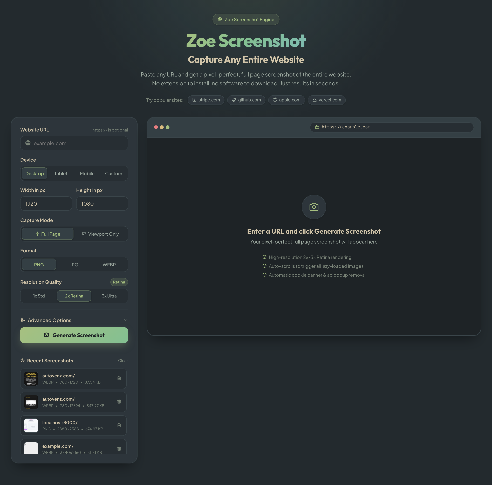

# Zoe Screenshot

A high-performance, pixel-perfect website screenshot tool and API. Built with **Node.js**, **Express**, and **Puppeteer**.



## Features

- **Full-Page & Viewport Modes**: Capture the entire scrollable height or only the above-the-fold viewport.
- **Multiple Formats**: Export in **PNG** (lossless), **JPG** (customizable quality), and **WEBP** (modern, ultra-lightweight).
- **High-Resolution / Retina (1x, 2x, 3x)**: Crisp, razor-sharp output scaling (`deviceScaleFactor: 2` or `3`).
- **Device Presets**:
  - **Desktop**: 1920×1080 (FHD), 1440×900, 1280×800
  - **Tablet**: 820×1180 (iPad Air), 1024×1366 (iPad Pro)
  - **Mobile**: 393×852 (iPhone 15 Pro), 412×915 (Pixel), 375×667
  - **Custom**: Any user-defined width and height
- **Smart Auto-Scroll**: Scrolls through the page to trigger all lazy-loaded images, SVG animations, and web fonts before capturing.
- **Ad & Cookie Banner Removal**: Automatically injects stealth rules to eliminate GDPR overlays, OneTrust banners, and sticky ads.
- **Color Scheme Emulation**: Emulate Light or Dark mode (`prefers-color-scheme`).
- **Interactive Web App**:
  - Zoom in/out, fit to screen, actual size (100%).
  - One-click copy image directly to clipboard.
  - Direct download menu.
  - Recent screenshots gallery with click-to-load and deletion.
  - Quick demo shortcuts (`stripe.com`, `apple.com`, `github.com`, `vercel.com`).
- **Direct Streaming API**: Stream screenshots directly via URL parameters.

---

## Quick Start

### 1. Install Dependencies
```bash
npm install
```

### 2. Start the Server
```bash
npm start
```
The application will be live at `http://localhost:3000`.

For auto-reloading during development:
```bash
npm run dev
```

---

## API Reference

### 1. Capture Screenshot (JSON Response)
`POST /api/screenshot`

#### Request Body (JSON):
```json
{
  "url": "https://stripe.com",
  "width": 1920,
  "height": 1080,
  "format": "webp",
  "quality": 85,
  "fullPage": true,
  "scale": 2,
  "delay": 1000,
  "blockBanners": true,
  "colorScheme": "dark",
  "isMobile": false
}
```

#### Response (JSON):
```json
{
  "success": true,
  "data": {
    "id": "3e86aef4a4bbf2fac494245b",
    "url": "https://stripe.com/",
    "filename": "screenshot-3e86aef4a4bbf2fac494245b.webp",
    "width": 1920,
    "height": 4820,
    "effectiveWidth": 3840,
    "effectiveHeight": 9640,
    "scale": 2,
    "format": "webp",
    "quality": 85,
    "fullPage": true,
    "sizeBytes": 421000,
    "sizeFormatted": "411.13 KB",
    "durationMs": 3450,
    "downloadUrl": "/api/download/screenshot-3e86aef4a4bbf2fac494245b.webp",
    "viewUrl": "/storage/screenshots/screenshot-3e86aef4a4bbf2fac494245b.webp"
  }
}
```

---

### 2. Direct Streaming Image API
`GET /api/screenshot/direct`

Embed screenshots directly into `` tags or download instantly:

```html

```

#### Query Parameters:
| Parameter | Type | Default | Description |
| :--- | :--- | :--- | :--- |
| `url` | String | **Required** | Target website URL (e.g. `https://apple.com`) |
| `format` | String | `png` | Image format: `png`, `jpg`, `webp` |
| `quality` | Number | `90` | Image compression quality (1-100, for JPG/WEBP) |
| `fullPage` | Boolean | `true` | Capture full scrollable page (`true` / `false`) |
| `scale` | Number | `2` | Device pixel ratio: `1` (standard), `2` (Retina), `3` (Ultra HD) |
| `width` | Number | `1920` | Viewport width in pixels |
| `height` | Number | `1080` | Viewport height in pixels |
| `delay` | Number | `0` | Extra wait time in milliseconds before snapshot |
| `blockBanners` | Boolean | `true` | Strip cookie notices & GDPR banners (`true` / `false`) |
| `colorScheme` | String | `no-preference` | `dark`, `light`, or `no-preference` |
| `isMobile` | Boolean | `false` | Emulate mobile touch & mobile User-Agent |

---

### 3. Recent History
`GET /api/history` - Returns list of recent captures.  
`DELETE /api/history/:id` - Deletes a capture from history and disk.

---

## Testing

Run test suite:
```bash
npm test
```
Or test all formats:
```bash
node test/test-formats.js
```

The default test suite is deterministic and does not require Internet access or launch Chromium.

---

## Production configuration

The service blocks local files, localhost, private/reserved IP ranges, and URLs containing credentials by default. It also limits concurrent captures, queued work, output dimensions, file size, and requests per client.

| Variable | Default | Purpose |
| :--- | :--- | :--- |
| `CAPTURE_CONCURRENCY` | `2` | Maximum simultaneous browser captures |
| `CAPTURE_QUEUE_LIMIT` | `20` | Maximum waiting capture requests |
| `CAPTURE_RATE_LIMIT` | `30` | Captures allowed per client per window |
| `CAPTURE_RATE_WINDOW_MS` | `60000` | Rate-limit window in milliseconds |
| `MAX_OUTPUT_PIXELS` | `100000000` | Maximum final rendered pixel count |
| `MAX_PAGE_HEIGHT` | `30000` | Maximum document height in CSS pixels |
| `MAX_SCREENSHOT_BYTES` | `52428800` | Maximum generated image size |
| `NAVIGATION_TIMEOUT_MS` | `30000` | Remote navigation timeout |
| `HISTORY_LIMIT` | `30` | Persisted capture records and files |
| `CORS_ORIGIN` | empty | Comma-separated allowed cross-origin callers; empty disables CORS |
| `TRUST_PROXY_HOPS` | `1` | Number of trusted reverse-proxy hops in production |
| `APP_USERNAME` | empty | Optional HTTP Basic username; authentication activates when both credentials exist |
| `APP_PASSWORD` | empty | Optional HTTP Basic password; use a long random secret |
| `CLIENT_ID_SECRET` | random per process | Signs anonymous browser identities; set a stable random value in production |
| `ALLOW_PRIVATE_NETWORK` | `false` | Allows private network targets; intended only for trusted local development |
| `EXPOSE_TEST_STATIC` | `false` | Exposes `/test-static`; intended only for local development |

The direct streaming endpoint does not persist generated images. Chromium and the HTTP server also shut down cleanly on `SIGINT` and `SIGTERM`.

Capture history is isolated per anonymous browser using a signed, HTTP-only cookie. No account is required: visitors can only list or delete their own captures, while individual random screenshot URLs remain shareable. Set a stable `CLIENT_ID_SECRET` in production so ownership survives redeployments.

### Dokploy

The included `docker-compose.yml` is prepared for Dokploy:

1. Create a **Docker Compose** service and select this repository.
2. Use `./docker-compose.yml` as the Compose path.
3. Add a domain in Dokploy and route it to service `zoe-screenshot`, port `3000`.
4. Configure the variables from `.env.example` in Dokploy's Environment tab. Set at least `APP_USERNAME`, `APP_PASSWORD`, and `CORS_ORIGIN` for the final HTTPS domain.
5. Keep a single replica while history uses the local JSON repository.
6. Enable backups for the named volume `zoe_storage`.

The service exposes port 3000 only to the container network; Traefik handles public HTTP/HTTPS traffic. `/health` is a lightweight liveness route, while `/ready` verifies that Chromium launches and storage is writable. Both routes intentionally remain outside optional Basic authentication so Dokploy can monitor the service.

For automatic rollback or zero-downtime settings, use `/ready` as the health route. Do not scale beyond one replica until screenshots and history are migrated to shared object storage and a database.

---

## Tech Stack

- **Runtime**: Node.js
- **Framework**: Express.js
- **Headless Engine**: Puppeteer with Google Chrome / Chromium
- **Frontend**: Vanilla HTML5, Modern CSS Design System, ES Modules JavaScript
- **Fonts & Icons**: Google Fonts (Outfit, Plus Jakarta Sans, JetBrains Mono), Phosphor Icons
